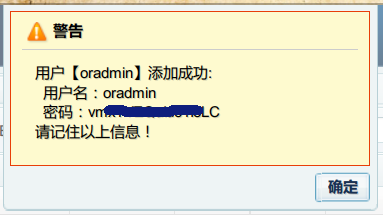
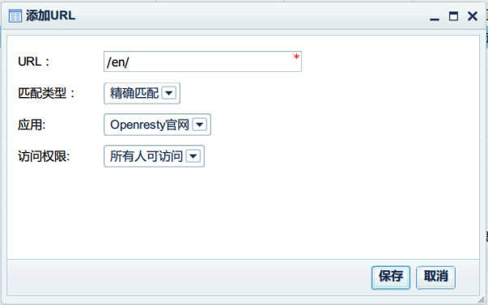

# 前言
--------
这里以openresty.org为例子，介绍管理后台的使用，及ngx-pms Agent配置说明

# 目录
* [权限规划](#权限规划)
* [角色规划](#角色规划)
* [添加管理员用户](#添加管理员用户)
* [添加应用](#添加应用)
* [添加普通用户](#添加普通用户)
* [基本权限管理](#基本权限管理)
* [OpenResty.org代理设置](#OpenResty.org代理设置)
* [测试用户](#测试用户)
* 
#### 权限规划
openresty.org上页面非常多，这儿只列出一部分链接，并只创建部分权限。

页面 | 匹配方式 | 需要权限 |权限说明
----|-----|----|-----
/ | 前缀匹配 | DENY_ALL | 所有人不可访问 | 
/ | 精确匹配 | ALLOW_ALL | 所有人可访问 | 
/en/ | 精确匹配 | ALLOW_ALL | 所有人可访问 | 
/cn/ | 前缀匹配 | OR_CN_ALL | OR中文所有
/en/download.html | 精确匹配 | OR_DL_IDX | 下载页首页
/en/download/ | 前缀匹配 | OR_DL_FILES | 下载文件权限
/en/installation.html | 精确匹配 |OR_INSTALL | 安装页权限
/en/getting-started.html |  精确匹配 |OR_GETSTART | 学习入门
/en/upgrading.html | 精确匹配 | OR_UPGRAD | 安装升级
/en/change | 前缀匹配 | OR_CHANGES | 更改日志
/en/components.html | 精确匹配 | OR_COMPONENT | 组件页
/en/community.html| 精确匹配 | OR_COMMUNITY | 社区
/en/benchmark.html| 精确匹配 | OR_BANCHMARK | 基准测试
/en/contact-us.html| 精确匹配 | OR_CONTACT_US | 联系我们
/en/about.html | 精确匹配 | OR_ABOUT | 关于我们
/en/debugging.html| 精确匹配 | OR_DEBUGGING | 调试
/images | 前缀匹配 | ALLOW_ALL | 所有人可访问 | 
/css | 前缀匹配 | ALLOW_ALL | 所有人可访问 | 

#### 角色规划
角色ID | 角色名称 | 包含的权限 
---|----|----
OR_DL | 下载安装升级 | OR_DL_IDX,OR_INSTALL, OR_UPGRAD
OR_CONTACT_ABOUT | 关于&关系我们 | OR_CONTACT_US, OR_ABOUT


#### 添加管理员用户
* 以root登录管理后台后，点击左侧的<用户管理>，然后点击<添加>按钮，在<添加用户>界面，输入管理员用户`oradmin`,界面如下：<br/>

* 点击<保存>后，会弹出如下提示框：<br/>

*请记住管理员帐号及密码。*

#### 添加应用
---------------
* 登录管理后台后,点击左侧的<应用管理>，界面如下：<br/>

* 然后点击<添加>，弹出应用添加的界面，输入相关信息后：<br/>

* 点击<保存>，保存成功后，会弹出如下提示框：<br/>
<br/>

 
#### 添加普通用户
-----------------
略，与添加管理员账号一样。

#### 基本权限管理
-----------------------
应用添加成功后，需要以应用管理员(oradmin)身份登录管理后台，进行相关的管理。*root帐号只能添加应用及用户，不能进行权限及URL管理。*

* 以应用管理员的帐号`oradmin`登录管理系统：<br/>
<br/>
* 应用管理员首次登录后，系统会提示选择当前要管理的应用，请选择openresty,并点击保存。
<br/>

* 登录后，点击右上角的<修改密码>，可以修改oradmin的密码：
<br/>

* 在<权限管理>中，点击<添加>：

依次添加权限，添加完成后，所有权限如下图：


* 在URL管理中，可以点击<添加>来添加一个新的URL，并设置其访问权限。<br/>

先添加一个URL为`/`,匹配类型为`前缀匹配`，访问权限为`所有人不可访问`的URL。由于URL都以/开头，所以这个URL能匹配所有`未匹配上其它URL的URL`。这个URL设置的意思是所有未配置的URL对所有人都不可访问<br/>
<br/>

再添加一个URL为`/en/`,匹配类型为`精确匹配`，访问权限为`所有人可访问`的URL。这个URL的意思是所有登录用户都可访问OR英文版的首页。<br/>
<br/>

添加完其它URL后，URL列表大概如下图：
<br/>

下面一节介绍在反向代理中设置pms的Agent。

#### OpenResty.org代理设置
pms agent需要设置在反向代理上，agent的设置如下。

* 反向代理及pms Agent配置如下(可参见ngx-pms/conf/pms-agent-or.conf)：

```nginx
    #保存cookie信息的共享内存。
    lua_shared_dict cookies 5m;
    #其它信息的缓存
    lua_shared_dict cache 2m;
    # 文件路径包含，分别是：项目，依赖库，及manager的文件。
    lua_package_path "/path/to/ngx-pms/lua/?.lua;/path/to/ngx-pms/libs/?.lua;/path/to/ngx-pms/manager/lua/?.lua;;";

    # pms-agent权限代理(可以与“pms授权接口”部署在一个nginx上，也可以分开部署)
    # 示例配置(openresty.org)
    server {
        listen       80 default;
        listen       1201 default;
        server_name openresty.org;

        # 以/pms开头的请求，需要代理到“pms授权接口”
        location /pms {
            proxy_set_header Host $host;
            proxy_set_header X-Real-IP $remote_addr;
            proxy_set_header REMOTE-HOST $remote_addr;
            proxy_set_header X-Forwarded-For $proxy_add_x_forwarded_for;
            proxy_set_header Accept-Encoding "";
            client_max_body_size 5m;
            client_body_buffer_size 256k;
            proxy_connect_timeout 10;
            proxy_send_timeout 10;
            proxy_read_timeout 10;
            proxy_buffer_size 256k;
            proxy_buffers 4 256k;
            proxy_busy_buffers_size 256k;
            proxy_temp_file_write_size 256k;
            proxy_max_temp_file_size 128m;
            # 这里要写“pms授权接口”的地址。
            proxy_pass    http://127.0.0.1:8000;
        }
        # 清除响应体大小。
        header_filter_by_lua_file /path/to/ngx-pms/lua/agent/header_filter.lua;
        # 过滤器，在相应页面，加上信息条。
        body_filter_by_lua_file /path/to/ngx-pms/lua/agent/body_filter.lua;
        
        # 应用的反向代理设置。
        location / {
            # $app变量的值，必须是已经在管理后台上已经添加成功的应用ID.
            set $app openresty;
            # 权限检查的脚本。
            access_by_lua_file /path/to/ngx-pms/lua/agent/permission_check.lua;

            proxy_set_header Host openresty.org;
            proxy_set_header X-Real-IP $remote_addr;
            proxy_set_header REMOTE-HOST $remote_addr;
            proxy_set_header X-Forwarded-For $proxy_add_x_forwarded_for;
            proxy_set_header Accept-Encoding "";
            client_max_body_size 5m;
            client_body_buffer_size 256k;
            proxy_connect_timeout 10;
            proxy_send_timeout 10;
            proxy_read_timeout 10;
            proxy_buffer_size 256k;
            proxy_buffers 4 256k;
            proxy_busy_buffers_size 256k;
            proxy_temp_file_write_size 256k;
            proxy_max_temp_file_size 128m;
            # 应用的实际地址。
            proxy_pass    https://openresty.org;
        }
    }
```
配置好之后，就可以启动反向代理了。然后就可以通过反向代理访问OR官网了。

* 在客户机上，将openresty.org解析到反向代理上（通过hosts）。然后访问`http://openresty.org/en/`，由于没有登录，统一权限管理系统会跳转到登录页面：
<br/>
* 输入帐号及密码后，就进入到了OR官网英文版首页了：<br/>
<br/>
注意看，页面右上边出现一个区域，上面有显示当前用户，修改密码，登出等选项。

* 当访问的页面没权限时，会出现类似下面的页面：
<br/>

#### 测试用户
暂无